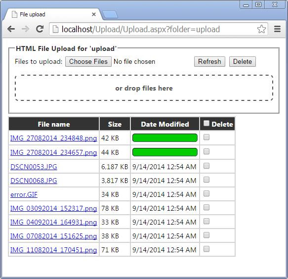
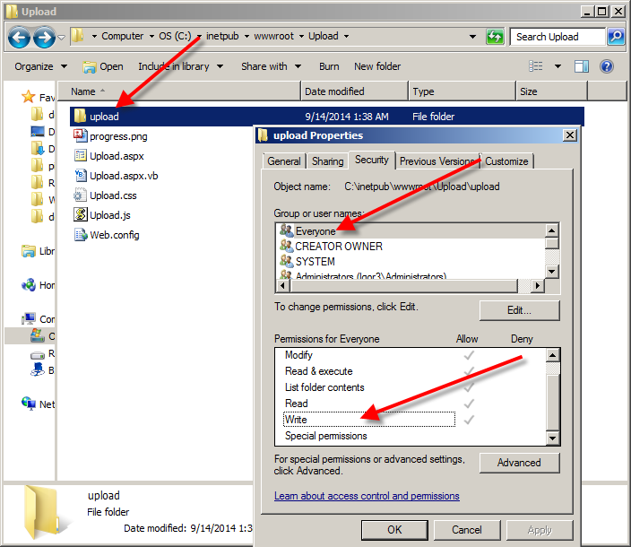

# Multiple File Upload with Progress Bar and Drag and Drop

Originally posted here:
https://www.codeproject.com/Articles/818561/Multiple-File-Upload-with-Progress-Bar-and-Drag-an

The ASP.NET pages let you upload, delete and browse files in a folder.

## Introduction
This ASP.NET application will let you upload multiple files manually or via drag and drop. It will show progress bar for each file as it uploads. Once uploaded, you can browse and delete these files.

## Background
This application is based on the sample provided by Craig Buckler.

## Using the Code

To use this application:

1. Download Upload2.zip and unzip it to C:\inetpub\wwwroot\Upload.

2. Give everyone (or the IIS anonymous user) access to C:\inetpub\wwwroot\Upload\upload folder.

3. Point your browser to http://localhost/Upload/Upload.aspx?folder=upload.

4. You can change URL from ?folder=upload to your folder like: folder=folder1 if you want to point the page to folder1.

